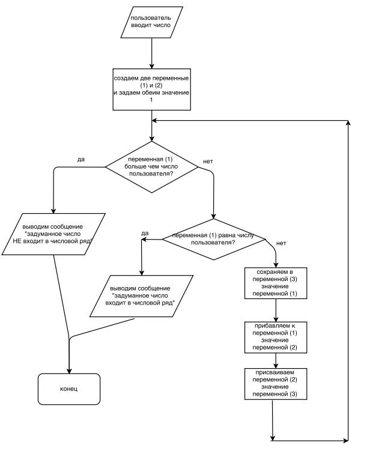

# Домашнее задание к лекции 1.1 «Введение в PHP»

1. Создать файл `about.php`.
2. Создать переменные и ввести в них: ваше имя, возраст, адрес электронной почты, город и краткий текст о себе.
3. Представить эту информацию в виде простого HTML-документа, используя шаблонную архитектуру языка PHP, и вывести результат ([пример](http://university.netology.ru/u/kopylov/samples/about.php)).
4. Разместить на хостинг в папку `/me/`.
5. Прислать PHP-код и ссылку на пример.

## Дополнительное задание

Реализуйте предложенный алгоритм на языке PHP ([пример](http://university.netology.ru/u/kopylov/samples/intro-dop.php?x=13)).

Догадались ли вы, какую задачу он решает и как называется числовой ряд, который используется в задании? Напишите в комментарии.

## Советы:
* Пункт «пользователь вводит число» можете пока реализовать через `$x = rand(0,100);` и затем сделайте `echo "Число ".$x;`, чтобы видеть с каким числом идет работа.
* Можно по-честному: `$x = $_GET['x'];`. В этом случае вы должны будете передать число в строке браузера `(script.php?x=100)` — именно так пользователи и передают данные в большинстве случаев. Подробнее о получении данных от пользователя вы узнаете далее в курсе.

---
Способы предоставить домашнее задание в порядке приоритета:
1. Исходный код на [BitBucket](https://bitbucket.org/) или [GitHub](https://github.com/).
2. Код в песочнице [codepad](http://codepad.org/) или [eval.in](https://eval.in/).
3. Доступ к рабочему пространству в [Cloud9](https://c9.io/) или [Сodeanywhere](https://codeanywhere.com/).

Не смогу проверить и помочь, если прислать:
* Архивы, особенно RAR.
* Скриншоты кода.
* Теоретический рассказ о возникших проблемах.
